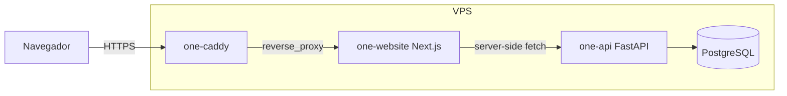
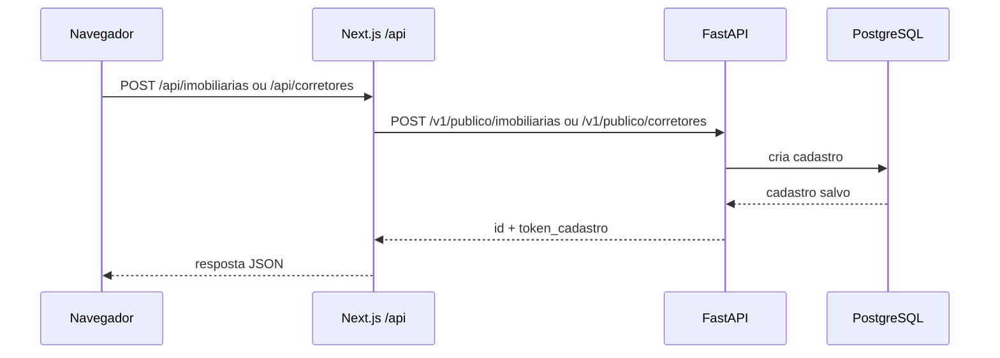
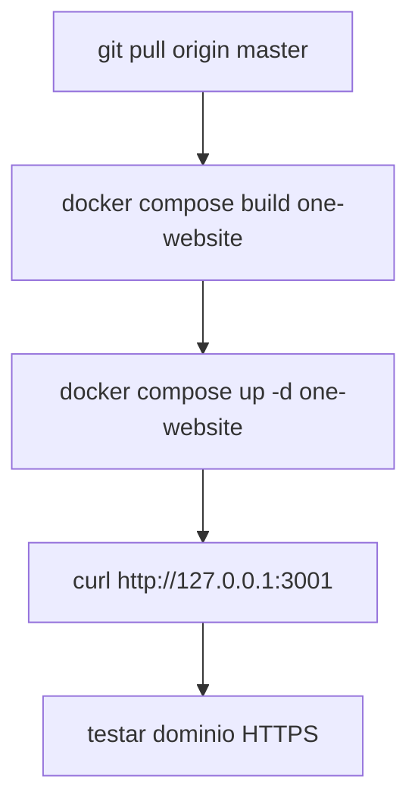

# ONE Fiança Locatícia Website

Site institucional e de cadastro de parceiros da ONE Fiança Locatícia.

Este projeto é uma aplicação Next.js com rotas internas de API. Ele não deve ser publicado como site estático nem via `output: "export"`, porque os formulários do site chamam rotas server-side em `/api/...`, que fazem proxy para o backend FastAPI.

## Stack

- Next.js 16
- React 19
- TypeScript
- Docker
- Caddy como proxy reverso com HTTPS automático
- Backend externo FastAPI para cadastros

## Arquitetura



O navegador deve chamar sempre o proprio dominio:

```txt
https://onefiancalocaticia.com.br
```

As chamadas de cadastro ficam relativas ao site:

```txt
/api/imobiliarias
/api/corretores
/api/imobiliarias/buscar
```

Essas rotas internas do Next.js chamam o backend server-side usando `ONE_BACKEND_URL`.

## Fluxo de Cadastro



## Rotas Internas do Site

| Rota Next.js | Metodo | Backend chamado |
| --- | --- | --- |
| `/api/imobiliarias` | `POST` | `/v1/publico/imobiliarias` |
| `/api/corretores` | `POST` | `/v1/publico/corretores` |
| `/api/imobiliarias/buscar` | `GET` | `/v1/publico/imobiliarias/buscar` quando existir |

Observacao: a busca de imobiliarias degrada para lista vazia se o backend ainda nao tiver endpoint publico de busca.

## Ambiente Local

Instale dependencias:

```bash
npm install
```

Crie o arquivo local:

```bash
cp .env.example .env
```

Para desenvolvimento local com backend rodando na sua maquina:

```env
ONE_BACKEND_URL=http://127.0.0.1:8000
```

Suba o site:

```bash
npm run dev
```

Acesse:

```txt
http://localhost:3000
```

## Build

```bash
npm run build
```

O projeto usa `output: "standalone"` em `next.config.ts` para permitir build Docker de producao.

## Docker Local

Para validar o Compose, crie `.env` e rode:

```bash
docker compose config
docker compose build
docker compose up -d
```

O container `one-website` expõe localmente:

```txt
http://127.0.0.1:3001
```

Em ambiente local sem a rede Docker do backend, `ONE_BACKEND_URL=http://one-api:8000` nao vai resolver. Use `http://127.0.0.1:8000` se o backend estiver rodando localmente.

## Deploy em Produção

Documentacao completa:

- [Visao geral do deploy](docs/deploy/README.md)
- [Deploy na VPS](docs/deploy/vps-deploy.md)
- [DNS Locaweb](docs/deploy/dns-locaweb.md)
- [Arquivos ignorados e variaveis](docs/deploy/env-files.md)
- [Runbook operacional](docs/deploy/runbook-operacional.md)
- [Troubleshooting](docs/deploy/troubleshooting.md)

Resumo do deploy:



## Arquivos Importantes

| Arquivo | Funcao |
| --- | --- |
| `app/page.tsx` | Entrada da home |
| `components/HomePage.tsx` | Composicao principal da landing page |
| `components/RegistrationModal.tsx` | Modal de cadastro de imobiliaria |
| `components/BrokerRegistrationModal.tsx` | Modal de cadastro de corretor |
| `app/api/imobiliarias/route.ts` | Proxy server-side para cadastro de imobiliarias |
| `app/api/corretores/route.ts` | Proxy server-side para cadastro de corretores |
| `app/api/imobiliarias/buscar/route.ts` | Proxy server-side de busca de imobiliarias |
| `Dockerfile` | Build standalone do Next.js |
| `docker-compose.yml` | Compose de producao do site e Caddy |
| `Caddyfile` | Proxy HTTPS para o dominio |
| `.env.example` | Exemplo sanitizado de variaveis |

## Arquivos Ignorados

Os arquivos ignorados por `.gitignore` nao devem ser commitados. A lista e explicacao completa estao em [docs/deploy/env-files.md](docs/deploy/env-files.md).

Principais exemplos:

- `.env`: variaveis reais de ambiente.
- `.env.local`: variaveis locais de desenvolvimento.
- `.next/`: build gerado pelo Next.js.
- `node_modules/`: dependencias instaladas.
- `build/` e `out/`: artefatos de build/export.

## Segurança

- Nao commitar `.env`, senhas, tokens, chaves SSH ou credenciais da VPS.
- Nao colocar `http://one-api:8000` em variaveis `NEXT_PUBLIC_*`, porque esse endereco e interno da rede Docker.
- O site nao deve acessar o PostgreSQL diretamente.
- O site deve falar com o backend somente via HTTP API.

## Checklist Antes de Subir

```bash
npm run build
docker compose config
```

Depois do deploy:

```bash
curl -I http://127.0.0.1:3001
curl -I https://onefiancalocaticia.com.br
```
