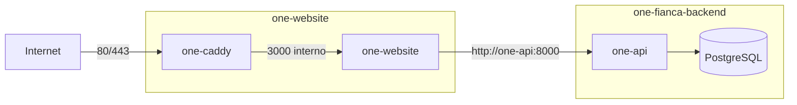
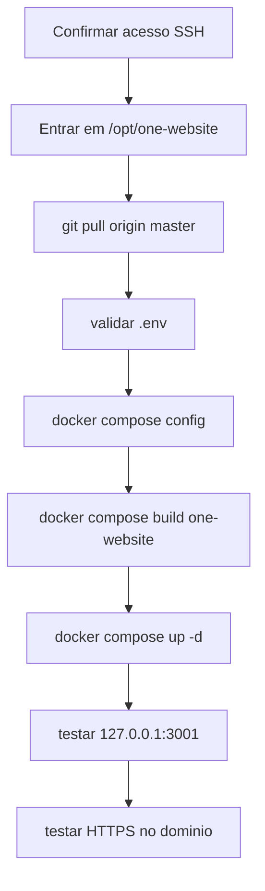

# Deploy do Site ONE

Esta pasta documenta o deploy do site Next.js da ONE Fiança Locatícia na VPS Hostinger.

## Objetivo

Publicar o site como aplicacao Next.js em Docker, preservando rotas internas `/api/...` e integracao server-side com o backend FastAPI.

## Topologia

## Caminhos na VPS

| Item | Caminho |
| --- | --- |
| Site | `/opt/one-website` |
| Backend | `/opt/one-fianca-backend` |
| Compose do site | `/opt/one-website/docker-compose.yml` |
| Env do site | `/opt/one-website/.env` |

## Containers

| Container | Funcao |
| --- | --- |
| `one-website` | Next.js em producao |
| `one-caddy` | Reverse proxy e HTTPS automatico |
| `one-api` | Backend FastAPI existente |

## Redes Docker

| Rede | Uso |
| --- | --- |
| `one-website_one_site` | Rede interna entre Caddy e site |
| `one-fianca-backend_one_public` | Rede externa para o site falar com `one-api` |

## Ordem Recomendada

## Documentos

- [Deploy na VPS](vps-deploy.md)
- [DNS Locaweb](dns-locaweb.md)
- [Arquivos ignorados e variaveis](env-files.md)
- [Runbook operacional](runbook-operacional.md)
- [Troubleshooting](troubleshooting.md)
